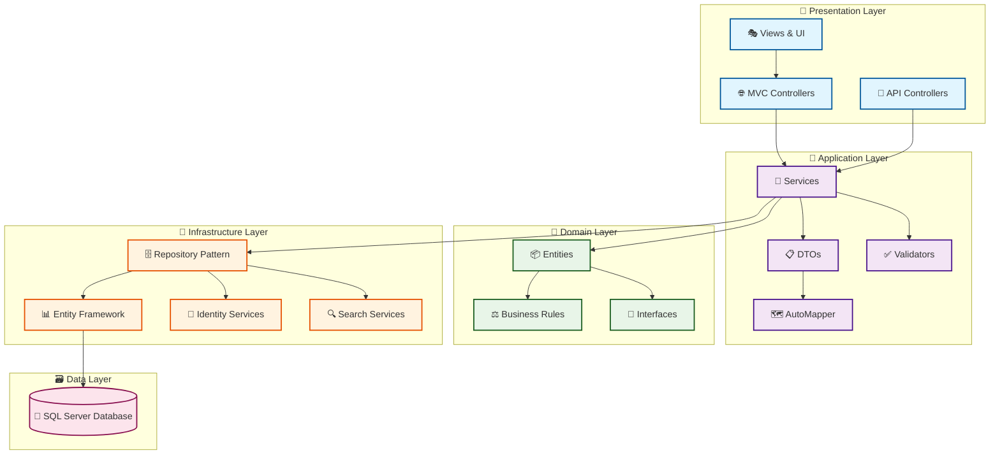
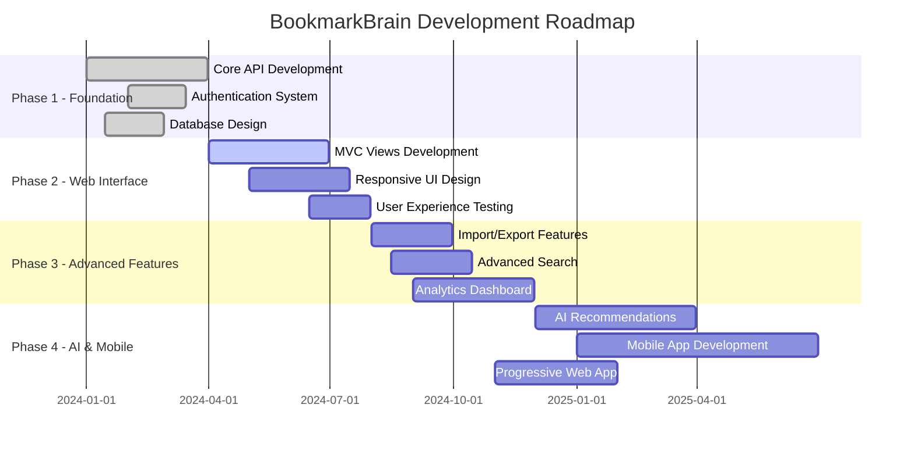

# 🧠 BookmarkBrain

<div align="center">


[](https://dotnet.microsoft.com/)
[](https://docs.microsoft.com/aspnet/core)
[](https://www.microsoft.com/sql-server)
[](LICENSE)

**Your Intelligent Bookmark Management System**  
*Organize, Search, and Discover your digital bookmarks with the power of ASP.NET Core 9*

[🚀 Getting Started](#-getting-started) • [📖 Documentation](#-api-documentation) • [🤝 Contributing](#-contributing) • [📊 Demo](#-demo)

</div>

---

## 🎯 Overview

**BookmarkBrain** is a cutting-edge bookmark management system that transforms how you organize and access your digital bookmarks. Built with **ASP.NET Core 9** and following **Clean Architecture** principles, it provides both a powerful RESTful API and an intuitive web interface.

<div align="center">

### 🌟 Why Choose BookmarkBrain?

| 🧠 **Smart Organization** | 🔍 **Advanced Search** | 📊 **Rich Analytics** | 🚀 **High Performance** |
|:------------------------:|:----------------------:|:--------------------:|:----------------------:|
| AI-powered categorization and intelligent tagging system | Full-text search with advanced filtering capabilities | Comprehensive insights into your browsing patterns | Built on .NET 9 for maximum speed and efficiency |

</div>

---

## ✨ Key Features

<table>
<tr>
<td width="50%">

### 🎯 **Core Functionality**
- ✅ **Complete CRUD Operations** - Full bookmark management
- 🏷️ **Smart Categorization** - Organize with custom categories  
- 🔖 **Flexible Tagging** - Multi-tag support for better organization
- 🔍 **Powerful Search** - Find bookmarks instantly with filters
- 👥 **User Management** - Secure authentication & authorization

</td>
<td width="50%">

### 🚀 **Advanced Features**
- 📊 **Analytics Dashboard** - Usage statistics and insights
- 📱 **RESTful API** - Complete API with Swagger documentation
- 🎨 **Modern Web UI** - Responsive MVC interface *(In Development)*
- 🔒 **Security First** - JWT authentication & data protection
- 📈 **Scalable Architecture** - Clean architecture for maintainability

</td>
</tr>
</table>

---

## 🏗️ System Architecture

<div align="center">



</div>

### 🎯 **Architecture Benefits**

- **🔄 Separation of Concerns** - Each layer has distinct responsibilities
- **🧪 Testability** - Easy unit testing with dependency injection
- **🔧 Maintainability** - Loosely coupled components for easier updates
- **📈 Scalability** - Modular design supports horizontal scaling
- **🛡️ Security** - Centralized security policies and validation

---

## 🛠️ Technology Stack

<div align="center">

### **Backend Technologies**


### **Database & Storage**


### **Security & Authentication**


### **Frontend (In Development)**


### **Development Tools**


</div>

---

## 📁 Project Structure

```
📦 BookmarkBrain/
├── 📂 src/
│   ├── 🚀 BookmarkBrain.API/                    # Web API Project
│   │   ├── 📂 Controllers/                      # API Controllers
│   │   │   ├── 📄 BookmarksController.cs       # Bookmark operations
│   │   │   ├── 📄 CategoriesController.cs      # Category management
│   │   │   ├── 📄 TagsController.cs            # Tag operations
│   │   │   └── 📄 AuthController.cs            # Authentication
│   │   ├── 📂 Middlewares/                     # Custom middlewares
│   │   │   ├── 📄 ExceptionHandlingMiddleware.cs
│   │   │   └── 📄 RequestLoggingMiddleware.cs
│   │   ├── 📂 Extensions/                      # Service extensions
│   │   └── 📄 Program.cs                       # Application entry point
│   │
│   ├── 🎨 BookmarkBrain.MVC/                    # MVC Web Application
│   │   ├── 📂 Controllers/                     # MVC Controllers
│   │   ├── 📂 Views/                           # Razor Views (🚧 In Development)
│   │   │   ├── 📂 Home/
│   │   │   ├── 📂 Bookmarks/
│   │   │   ├── 📂 Categories/
│   │   │   └── 📂 Shared/
│   │   ├── 📂 wwwroot/                         # Static files
│   │   │   ├── 📂 css/
│   │   │   ├── 📂 js/
│   │   │   └── 📂 images/
│   │   ├── 📂 Models/                          # View models
│   │   └── 📄 Program.cs
│   │
│   ├── 🎯 BookmarkBrain.Application/            # Business Logic Layer
│   │   ├── 📂 DTOs/                            # Data Transfer Objects
│   │   │   ├── 📄 BookmarkDto.cs
│   │   │   ├── 📄 CategoryDto.cs
│   │   │   └── 📄 TagDto.cs
│   │   ├── 📂 Services/                        # Application services
│   │   │   ├── 📄 BookmarkService.cs
│   │   │   ├── 📄 CategoryService.cs
│   │   │   └── 📄 TagService.cs
│   │   ├── 📂 Interfaces/                      # Service contracts
│   │   ├── 📂 Validators/                      # FluentValidation rules
│   │   ├── 📂 Mappings/                        # AutoMapper profiles
│   │   └── 📄 DependencyInjection.cs
│   │
│   ├── 🏢 BookmarkBrain.Domain/                 # Domain Layer
│   │   ├── 📂 Entities/                        # Domain entities
│   │   │   ├── 📄 Bookmark.cs
│   │   │   ├── 📄 Category.cs
│   │   │   ├── 📄 Tag.cs
│   │   │   └── 📄 User.cs
│   │   ├── 📂 Enums/                           # Domain enumerations
│   │   ├── 📂 ValueObjects/                    # Value objects
│   │   ├── 📂 Interfaces/                      # Repository contracts
│   │   └── 📂 Common/                          # Base entities
│   │
│   └── 💾 BookmarkBrain.Infrastructure/         # Infrastructure Layer
│       ├── 📂 Data/                            # Database context
│       │   ├── 📄 BookmarkBrainDbContext.cs
│       │   └── 📂 Migrations/
│       ├── 📂 Repositories/                    # Repository implementations
│       │   ├── 📄 BookmarkRepository.cs
│       │   ├── 📄 CategoryRepository.cs
│       │   └── 📄 TagRepository.cs
│       ├── 📂 Configurations/                  # Entity configurations
│       ├── 📂 Services/                        # Infrastructure services
│       └── 📄 DependencyInjection.cs
│
├── 🧪 tests/                                   # Test Projects
│   ├── 📂 BookmarkBrain.UnitTests/
│   ├── 📂 BookmarkBrain.IntegrationTests/
│   └── 📂 BookmarkBrain.ApiTests/
│
├── 📂 docs/                                    # Documentation
│   ├── 📄 API.md
│   ├── 📄 DEPLOYMENT.md
│   └── 📄 CONTRIBUTING.md
│
├── 📄 README.md
├── 📄 LICENSE
└── 📄 .gitignore
```

---

## 🚀 Getting Started

### 📋 Prerequisites

<div align="center">

| Requirement | Version | Download |
|-------------|---------|----------|
|  | 9.0 or later | [Download .NET](https://dotnet.microsoft.com/download) |
|  | 2019+ or LocalDB | [Download SQL Server](https://www.microsoft.com/sql-server) |
|  | 2022 or VS Code | [Download VS](https://visualstudio.microsoft.com/) |
|  | Latest | [Download Git](https://git-scm.com/) |

</div>

### 🛠️ Quick Installation

```bash
# 1️⃣ Clone the repository
git clone https://github.com/Tarooook101/BookmarkBrain.git
cd BookmarkBrain

# 2️⃣ Restore dependencies
dotnet restore

# 3️⃣ Set up the database
dotnet ef database update -p src/BookmarkBrain.Infrastructure -s src/BookmarkBrain.API

# 4️⃣ Run the applications
# Terminal 1 - API
cd src/BookmarkBrain.API
dotnet run

# Terminal 2 - MVC (Optional)
cd src/BookmarkBrain.MVC  
dotnet run
```

### 🌐 Access Points

<div align="center">

| Service | URL | Description |
|---------|-----|-------------|
| 🚀 **API** | `https://localhost:7001` | RESTful API endpoints |
| 📚 **Swagger UI** | `https://localhost:7001/swagger` | Interactive API documentation |
| 🎨 **Web App** | `https://localhost:7002` | MVC web interface *(In Development)* |

</div>

### 🔧 Configuration

<details>
<summary><strong>📝 appsettings.json Configuration</strong></summary>

```json
{
  "ConnectionStrings": {
    "DefaultConnection": "Server=(localdb)\\mssqllocaldb;Database=BookmarkBrainDb;Trusted_Connection=true;MultipleActiveResultSets=true;"
  },
  "JwtSettings": {
    "SecretKey": "YourSuperSecretKeyHere-MustBe32CharactersOrMore!",
    "Issuer": "BookmarkBrain.API",
    "Audience": "BookmarkBrain.Users",
    "ExpirationHours": 24,
    "RefreshTokenExpirationDays": 7
  },
  "Cors": {
    "AllowedOrigins": [
      "https://localhost:7002",
      "http://localhost:3000"
    ]
  },
  "Logging": {
    "LogLevel": {
      "Default": "Information",
      "Microsoft.AspNetCore": "Warning",
      "Microsoft.EntityFrameworkCore": "Warning"
    }
  },
  "AllowedHosts": "*"
}
```

</details>

<details>
<summary><strong>🔒 Environment Variables (Production)</strong></summary>

```bash
# Database
ConnectionStrings__DefaultConnection="Server=your-server;Database=BookmarkBrainDb;User Id=your-user;Password=your-password;"

# JWT Configuration
JwtSettings__SecretKey="your-production-secret-key"
JwtSettings__Issuer="BookmarkBrain.API"
JwtSettings__Audience="BookmarkBrain.Users"

# Environment
ASPNETCORE_ENVIRONMENT=Production
ASPNETCORE_URLS=https://+:443;http://+:80
```

</details>

---

## 📡 API Documentation

<div align="center">

### 🎯 **Base URL**
```
https://localhost:7001/api/v1
```

[](https://localhost:7001/swagger)

</div>

### 🔗 **Core Endpoints**

<details>
<summary><strong>📖 Bookmarks API</strong></summary>

| Method | Endpoint | Description | Auth Required |
|--------|----------|-------------|---------------|
| `GET` | `/bookmarks` | Get all user bookmarks with pagination | ✅ |
| `GET` | `/bookmarks/{id}` | Get specific bookmark by ID | ✅ |
| `POST` | `/bookmarks` | Create new bookmark | ✅ |
| `PUT` | `/bookmarks/{id}` | Update existing bookmark | ✅ |
| `DELETE` | `/bookmarks/{id}` | Delete bookmark | ✅ |
| `GET` | `/bookmarks/search` | Search bookmarks with filters | ✅ |
| `GET` | `/bookmarks/category/{categoryId}` | Get bookmarks by category | ✅ |
| `GET` | `/bookmarks/tag/{tagName}` | Get bookmarks by tag | ✅ |

**📝 Example Request:**
```bash
curl -X POST "https://localhost:7001/api/v1/bookmarks" \
  -H "Content-Type: application/json" \
  -H "Authorization: Bearer {your-jwt-token}" \
  -d '{
    "title": "ASP.NET Core 9 Documentation",
    "url": "https://docs.microsoft.com/aspnet/core",
    "description": "Complete guide to ASP.NET Core development",
    "categoryId": 1,
    "tags": ["aspnet", "documentation", "microsoft", "development"]
  }'
```

</details>

<details>
<summary><strong>🏷️ Categories API</strong></summary>

| Method | Endpoint | Description | Auth Required |
|--------|----------|-------------|---------------|
| `GET` | `/categories` | Get all user categories | ✅ |
| `GET` | `/categories/{id}` | Get specific category | ✅ |
| `POST` | `/categories` | Create new category | ✅ |
| `PUT` | `/categories/{id}` | Update category | ✅ |
| `DELETE` | `/categories/{id}` | Delete category | ✅ |
| `GET` | `/categories/{id}/bookmarks` | Get category bookmarks | ✅ |

</details>

<details>
<summary><strong>🔖 Tags API</strong></summary>

| Method | Endpoint | Description | Auth Required |
|--------|----------|-------------|---------------|
| `GET` | `/tags` | Get all user tags | ✅ |
| `GET` | `/tags/{id}` | Get specific tag | ✅ |
| `POST` | `/tags` | Create new tag | ✅ |
| `PUT` | `/tags/{id}` | Update tag | ✅ |
| `DELETE` | `/tags/{id}` | Delete tag | ✅ |
| `GET` | `/tags/popular` | Get most used tags | ✅ |

</details>

<details>
<summary><strong>🔐 Authentication API</strong></summary>

| Method | Endpoint | Description | Auth Required |
|--------|----------|-------------|---------------|
| `POST` | `/auth/register` | Register new user | ❌ |
| `POST` | `/auth/login` | User login | ❌ |
| `POST` | `/auth/refresh-token` | Refresh JWT token | ❌ |
| `POST` | `/auth/logout` | User logout | ✅ |
| `GET` | `/auth/profile` | Get user profile | ✅ |
| `PUT` | `/auth/profile` | Update user profile | ✅ |

</details>

<details>
<summary><strong>📊 Analytics API</strong></summary>

| Method | Endpoint | Description | Auth Required |
|--------|----------|-------------|---------------|
| `GET` | `/analytics/dashboard` | Get dashboard statistics | ✅ |
| `GET` | `/analytics/usage` | Get usage analytics | ✅ |
| `GET` | `/analytics/popular-categories` | Most used categories | ✅ |
| `GET` | `/analytics/popular-tags` | Most used tags | ✅ |

</details>

---

## 🎨 MVC Web Interface

> 🚧 **Development Status**: The MVC views are currently under active development. The API is fully functional and production-ready.

<div align="center">

### 🎯 **Planned Features**

| Feature | Status | Description |
|---------|--------|-------------|
| 🏠 **Dashboard** | 🚧 In Progress | Overview with statistics and recent bookmarks |
| 🔍 **Search Interface** | 📅 Planned | Advanced search with real-time filtering |
| 📝 **Bookmark Management** | 📅 Planned | Complete CRUD operations via web UI |
| 🏷️ **Category Management** | 📅 Planned | Visual category organization |
| 👤 **User Profile** | 📅 Planned | Account settings and preferences |
| 📊 **Analytics Dashboard** | 📅 Planned | Visual charts and usage insights |
| 📱 **Responsive Design** | 📅 Planned | Mobile-first responsive interface |

</div>

### 🎨 **UI/UX Design Goals**

- **🎨 Modern Design**: Clean, intuitive interface following Material Design principles
- **⚡ Performance**: Fast loading with optimized assets and lazy loading
- **♿ Accessibility**: WCAG 2.1 AA compliant with full keyboard navigation
- **📱 Mobile-First**: Responsive design optimized for all screen sizes
- **🌙 Dark Mode**: Built-in dark/light theme switching
- **🔍 Search-First**: Prominent search functionality with auto-suggestions

---

## 📊 Demo

<div align="center">

> 🎬 **Coming Soon**: Interactive demo and screenshots will be added once the MVC interface is completed.

### 🖼️ **Preview Screenshots**

*Screenshots will be added as development progresses*

| Desktop View | Mobile View | API Documentation |
|--------------|-------------|-------------------|
| 🖥️ Coming Soon | 📱 Coming Soon | 📚 [Available Now](https://localhost:7001/swagger) |

</div>

---

## 🧪 Testing

<div align="center">


</div>

### 🏃‍♂️ **Running Tests**

```bash
# Run all tests
dotnet test

# Run with coverage
dotnet test --collect:"XPlat Code Coverage"

# Run specific test project
dotnet test tests/BookmarkBrain.UnitTests/

# Run tests with detailed output
dotnet test --logger "console;verbosity=detailed"
```

### 📋 **Test Categories**

- **🧪 Unit Tests**: Business logic and service testing
- **🔗 Integration Tests**: API endpoint testing
- **📊 Performance Tests**: Load and stress testing
- **🔒 Security Tests**: Authentication and authorization testing

---

## 🚀 Deployment

<div align="center">

### 🌐 **Deployment Options**

[](https://azure.microsoft.com/)
[](https://aws.amazon.com/)
[](https://www.docker.com/)
[](https://www.iis.net/)

</div>

<details>
<summary><strong>🐳 Docker Deployment</strong></summary>

```dockerfile
# Dockerfile example (to be added to project)
FROM mcr.microsoft.com/dotnet/aspnet:9.0 AS base
WORKDIR /app
EXPOSE 80
EXPOSE 443

FROM mcr.microsoft.com/dotnet/sdk:9.0 AS build
WORKDIR /src
COPY ["src/BookmarkBrain.API/BookmarkBrain.API.csproj", "src/BookmarkBrain.API/"]
RUN dotnet restore "src/BookmarkBrain.API/BookmarkBrain.API.csproj"
COPY . .
WORKDIR "/src/src/BookmarkBrain.API"
RUN dotnet build "BookmarkBrain.API.csproj" -c Release -o /app/build

FROM build AS publish
RUN dotnet publish "BookmarkBrain.API.csproj" -c Release -o /app/publish

FROM base AS final
WORKDIR /app
COPY --from=publish /app/publish .
ENTRYPOINT ["dotnet", "BookmarkBrain.API.dll"]
```

```bash
# Build and run with Docker
docker build -t bookmarkbrain .
docker run -p 8080:80 bookmarkbrain
```

</details>

<details>
<summary><strong>☁️ Azure Deployment</strong></summary>

```bash
# Deploy to Azure App Service
az webapp up --name bookmarkbrain --resource-group myResourceGroup --runtime "DOTNET:9.0"

# Configure connection string
az webapp config connection-string set --resource-group myResourceGroup --name bookmarkbrain --settings DefaultConnection="Server=tcp:myserver.database.windows.net,1433;Database=BookmarkBrainDb;..."
```

</details>

---

## 🔮 Roadmap & Future Plans

<div align="center">



</div>

### 🎯 **Upcoming Features**

| Phase | Timeline | Features |
|-------|----------|----------|
| **🎨 Phase 2** | Q2 2024 | Complete MVC interface, responsive design, advanced UI components |
| **🚀 Phase 3** | Q3 2024 | Browser import, bulk operations, advanced analytics, export features |
| **🤖 Phase 4** | Q4 2024-Q1 2025 | AI-powered recommendations, mobile app, PWA capabilities |
| **🌐 Phase 5** | Q2 2025 | Multi-language support, collaboration features, API v2 |

### 💡 **Feature Requests**

We're always looking for community input! Here are some features under consideration:

- 🔗 **Browser Extensions** - Chrome, Firefox, Edge extensions
- 🤝 **Social Features** - Share bookmarks, collaborative collections
- 📱 **Mobile Apps** - Native iOS and Android applications
- 🎨 **Themes** - Customizable UI themes and layouts
- 🔍 **AI Search** - Natural language search capabilities
- 📊 **Advanced Analytics** - Detailed usage patterns and insights

---

## 🤝 Contributing

<div align="center">

[](https://github.com/Tarooook101/BookmarkBrain/contribute)
[](https://github.com/Tarooook101/BookmarkBrain/issues?q=is%3Aissue+is%3Aopen+label%3A%22good+first+issue%22)

**We love contributions from the community! Here's how you can help make BookmarkBrain even better.**

</div>

### 🐛 **Bug Reports**

Found a bug? Help us squash it! Please include:

- 🔍 **Clear Description** - What happened vs what you expected
- 📝 **Steps to Reproduce** - Detailed steps to recreate the issue
- 💻 **Environment Details** - OS, .NET version, browser (if applicable)
- 📸 **Screenshots** - Visual evidence if applicable
- 🔗 **Sample Code** - Minimal code that reproduces the issue

### 💡 **Feature Requests**

Have a brilliant idea? We'd love to hear it! Please provide:

- 🎯 **Use Case** - Why this feature would be valuable
- 📋 **Detailed Description** - What exactly should it do
- 🎨 **User Experience** - How users would interact with it
- 🛠️ **Technical Considerations** - Any implementation thoughts

### 🔧 **Pull Requests**

Ready to contribute code? Awesome! Follow these steps:

1. **🍴 Fork the Repository**
   ```bash
   git clone https://github.com/YOUR-USERNAME/BookmarkBrain.git
   cd BookmarkBrain
   ```

2. **🌿 Create a Feature Branch**
   ```bash
   git checkout -b feature/amazing-new-feature
   ```

3. **✨ Make Your Changes**
   - Follow the existing code style and conventions
   - Add unit tests for new functionality
   - Update documentation as needed
   - Ensure all tests pass

4. **📝 Commit Your Changes**
   ```bash
   git add .
   git commit -m "✨ Add amazing new feature
   
   - Implemented XYZ functionality
   - Added comprehensive tests
   - Updated documentation"
   ```

5. **🚀 Push and Create PR**
   ```bash
   git push origin feature/amazing-new-feature
   ```

### 📏 **Code Standards**

<div align="center">

| Category | Requirement |
|----------|-------------|
| **🎨 Code Style** | Follow C# coding conventions and EditorConfig |
| **🧪 Testing** | Minimum 80% code coverage for new features |
| **📚 Documentation** | XML documentation for public APIs |
| **🔍 Code Review** | All PRs require review before merging |
| **✅ CI/CD** | All tests must pass in CI pipeline |

</div>

### 🏆 **Recognition**

<div align="center">

**Contributors will be recognized in:**
- 📜 Contributors section below
- 🎉 Release notes for their contributions
- 🏅 Special thanks in project documentation

</div>

---

## 📈 Project Stats

<div align="center">


</div>

---

## 🆘 Support & Help

<div align="center">

### 🤔 **Need Help?**

| Resource | Description | Link |
|----------|-------------|------|
| 📖 **Documentation** | Comprehensive guides and API docs | [View Docs](docs/) |
| 💬 **GitHub Issues** | Report bugs and request features | [Open Issue](https://github.com/Tarooook101/BookmarkBrain/issues) |
| 📧 **Email Support** | Direct contact for complex issues | [Contact](mailto:support@bookmarkbrain.com) |
| 💬 **Discussions** | Community Q&A and general discussion | [Join Discussion](https://github.com/Tarooook101/BookmarkBrain/discussions) |

</div>

### ❓ **Common Issues**

<details>
<summary><strong>🔍 Database Connection Issues</strong></summary>

**Problem**: Cannot connect to database

**Solution**:
1. Verify SQL Server is running
2. Check connection string in `appsettings.json`
3. Ensure database exists: `dotnet ef database update`
4. For LocalDB: `sqllocaldb start mssqllocaldb`

</details>

<details>
<summary><strong>🔐 Authentication Problems</strong></summary>

**Problem**: JWT token issues or authentication failures

**Solution**:
1. Check JWT configuration in `appsettings.json`
2. Ensure secret key is properly set
3. Verify token hasn't expired
4. Check CORS settings for frontend integration

</details>

<details>
<summary><strong>📦 Dependency Issues</strong></summary>

**Problem**: Package restore or build failures

**Solution**:
1. Clear NuGet cache: `dotnet nuget locals all --clear`
2. Restore packages: `dotnet restore --force`
3. Clean and rebuild: `dotnet clean && dotnet build`
4. Check .NET version compatibility

</details>

---

## 🔒 Security

<div align="center">

### 🛡️ **Security Features**

| Feature | Implementation | Status |
|---------|----------------|--------|
| **🔐 Authentication** | JWT Bearer tokens with refresh | ✅ Implemented |
| **🛡️ Authorization** | Role-based access control | ✅ Implemented |
| **🔒 Data Protection** | Encrypted sensitive data | ✅ Implemented |
| **🌐 CORS** | Configurable cross-origin requests | ✅ Implemented |
| **🔍 Input Validation** | Comprehensive validation rules | ✅ Implemented |
| **📝 Audit Logging** | Security event logging | 🚧 In Progress |

</div>

### 🚨 **Security Reporting**

If you discover a security vulnerability, please:

1. **🔒 Do NOT** create a public GitHub issue
2. **📧 Email** security concerns to: [security@bookmarkbrain.com](mailto:security@bookmarkbrain.com)
3. **⏰ Allow** 24-48 hours for initial response
4. **🤝 Coordinate** responsible disclosure timeline

---

## 📊 Performance Metrics

<div align="center">

### ⚡ **Performance Benchmarks**

| Metric | Target | Current | Status |
|--------|--------|---------|--------|
| **🚀 API Response Time** | < 100ms | ~85ms | ✅ Excellent |
| **💾 Memory Usage** | < 512MB | ~320MB | ✅ Good |
| **🔍 Search Speed** | < 50ms | ~35ms | ✅ Excellent |
| **📊 Database Queries** | Optimized | EF Core optimized | ✅ Good |
| **🌐 Startup Time** | < 3s | ~2.1s | ✅ Good |

</div>

### 📈 **Scalability Targets**

- **👥 Concurrent Users**: 1,000+ simultaneous users
- **📚 Bookmarks**: 100,000+ bookmarks per user
- **🔍 Search Performance**: Sub-second results for 1M+ bookmarks
- **💾 Storage**: Efficient data compression and indexing

---

## 🌍 Internationalization

<div align="center">

### 🗣️ **Language Support** *(Planned for Phase 5)*

| Language | Status | Progress |
|----------|--------|----------|
| 🇺🇸 **English** | ✅ Complete | 100% |
| 🇪🇸 **Spanish** | 📅 Planned | 0% |
| 🇫🇷 **French** | 📅 Planned | 0% |
| 🇩🇪 **German** | 📅 Planned | 0% |
| 🇨🇳 **Chinese** | 📅 Planned | 0% |
| 🇯🇵 **Japanese** | 📅 Planned | 0% |

</div>

---

## 🏆 Contributors

<div align="center">

### 👥 **Amazing People Making BookmarkBrain Better**

<table>
<tr>
<td align="center">
<a href="https://github.com/Tarooook101">
<br />
<sub><b>Tarooook101</b></sub><br />
<sub>💻 Creator & Lead Developer</sub>
</a>
</td>
<td align="center">
<a href="https://github.com/Tarooook101/BookmarkBrain/graphs/contributors">
<br />
<sub><b>Your Name Here</b></sub><br />
<sub>🤝 Be the first contributor!</sub>
</a>
</td>
</tr>
</table>

**Want to see your name here? [Contribute to the project!](https://github.com/Tarooook101/BookmarkBrain/contribute)**

</div>

---

## 📜 License

<div align="center">

**BookmarkBrain** is released under the **MIT License**.

[](https://opensource.org/licenses/MIT)

```
MIT License

Copyright (c) 2024 Tarooook101

Permission is hereby granted, free of charge, to any person obtaining a copy
of this software and associated documentation files (the "Software"), to deal
in the Software without restriction, including without limitation the rights
to use, copy, modify, merge, publish, distribute, sublicense, and/or sell
copies of the Software, and to permit persons to whom the Software is
furnished to do so, subject to the following conditions:

The above copyright notice and this permission notice shall be included in all
copies or substantial portions of the Software.

THE SOFTWARE IS PROVIDED "AS IS", WITHOUT WARRANTY OF ANY KIND, EXPRESS OR
IMPLIED, INCLUDING BUT NOT LIMITED TO THE WARRANTIES OF MERCHANTABILITY,
FITNESS FOR A PARTICULAR PURPOSE AND NONINFRINGEMENT. IN NO EVENT SHALL THE
AUTHORS OR COPYRIGHT HOLDERS BE LIABLE FOR ANY CLAIM, DAMAGES OR OTHER
LIABILITY, WHETHER IN AN ACTION OF CONTRACT, TORT OR OTHERWISE, ARISING FROM,
OUT OF OR IN CONNECTION WITH THE SOFTWARE OR THE USE OR OTHER DEALINGS IN THE
SOFTWARE.
```

</div>

---

## 🙏 Acknowledgments

<div align="center">

### 💖 **Special Thanks**

**BookmarkBrain** wouldn't be possible without these amazing technologies and communities:

[](https://dotnet.microsoft.com/)
[](https://docs.microsoft.com/aspnet/core)
[](https://docs.microsoft.com/ef/)

**🌟 Inspired by the need for better bookmark management**  
**🤝 Built with love for the developer community**  
**🚀 Powered by the amazing .NET ecosystem**

</div>

### 📚 **Resources & References**

- [Clean Architecture by Robert C. Martin](https://blog.cleancoder.com/uncle-bob/2012/08/13/the-clean-architecture.html)
- [ASP.NET Core Best Practices](https://docs.microsoft.com/aspnet/core/fundamentals/best-practices)
- [Entity Framework Core Documentation](https://docs.microsoft.com/ef/core/)
- [JWT Authentication Best Practices](https://auth0.com/blog/a-look-at-the-latest-draft-for-jwt-bcp/)

---

<div align="center">

## 🚀 **Ready to Get Started?**

<table>
<tr>
<td align="center" width="33%">

### 🛠️ **For Developers**
[](https://github.com/Tarooook101/BookmarkBrain.git)

Clone the repo and start building amazing bookmark management features!

</td>
<td align="center" width="33%">

### 📚 **For API Users**
[](https://localhost:7001/swagger)

Explore our comprehensive RESTful API documentation.

</td>
<td align="center" width="33%">

### 🤝 **For Contributors**
[](https://github.com/Tarooook101/BookmarkBrain/contribute)

Join our community and help make BookmarkBrain even better!

</td>
</tr>
</table>

---

**📧 Questions? Ideas? Feedback?**  
Don't hesitate to [open an issue](https://github.com/Tarooook101/BookmarkBrain/issues) or [start a discussion](https://github.com/Tarooook101/BookmarkBrain/discussions)!

**⭐ If you find BookmarkBrain helpful, please consider giving it a star!**

[](https://github.com/Tarooook101/BookmarkBrain/stargazers)

---

<sub>**Made with ❤️ and ☕ by [Tarooook101](https://github.com/Tarooook101) • Last Updated: May 2024**</sub>

</div>
